# Research Catalyst — Large Presentation Overview

Use this as a **source document**: copy sections into slides, delete what you do not need, or collapse bullets into titles. **Diagrams** are in Mermaid — paste into [mermaid.live](https://mermaid.live), GitHub, Notion, or a PowerPoint Mermaid add-in, then export as PNG/SVG for your deck.

---

## Document map (quick navigation)

| Section | Use for slides about… |
|---------|------------------------|
| Objectives | Why the project exists |
| Problem & existing system | Motivation |
| Proposed system & scope | What we built |
| System architecture (multiple diagrams) | Big picture |
| Data & persistence | Where state lives |
| Methodology & workflow | How we work / how requests flow |
| Technologies | Stack slide |
| Module-by-module implementation | Feature demos |
| Pipelines (search, multi-agent, code mapper, editor) | Deep-dive optional slides |
| Non-functional / config | Deployment, env vars |
| Diagram index | All figures in one place |

---

## 1. Objectives

### 1.1 Primary objectives

- **Unify** the research workflow: discovery, planning, reading, writing, visualization, code–paper linking, and quality checks behind **one backend API**.
- **Reduce context switching** between Scholar, reference managers, Overleaf, ad-hoc scripts, and separate AI tools.
- **Accelerate** repetitive work: federated search, AI summaries, LaTeX compile loops, structured literature screening, multi-agent literature synthesis.
- **Provide a stable integration surface** for the **Next.js** frontend via **REST JSON**, **file uploads**, and **Server-Sent Events (SSE)** where streaming is needed.

### 1.2 Secondary / technical objectives

- **Modular backend**: each domain (`paper_search`, `visualization`, `planner`, …) owns `routes/`, `services/`, `models/` with clear prefixes under `/api/*`.
- **Optional persistence**: **PostgreSQL** when `DATABASE_URL` is set; graceful **in-memory fallbacks** for several features when DB is off.
- **Observable boundaries**: health check, job IDs for long tasks, SSE progress for pipelines.
- **Extensibility**: new providers (search), new export formats, or new agents without rewriting the whole app.

### 1.3 Success criteria (examples you can phrase for reviewers)

- A researcher can **search** multiple scholarly sources in one call, **plan** milestones, **screen** papers, **draft** in LaTeX with AI assist, **map** a paper to code or a repo to a report, and run a **multi-agent** literature pass — all through documented HTTP APIs.

---

## 2. Problem statement & existing system

### 2.1 Typical pain points (before)

- **Fragmented tooling**: Google Scholar / publisher sites for discovery; Zotero/Mendeley for references; Word/Overleaf for writing; GitHub for code; no single **project** that ties evidence to writing.
- **No unified API**: Frontend or automation cannot call one service for search + planner + editor state + retrieval.
- **Manual tracking**: PRISMA-style screening, milestone dates, and “which paper supported which claim” are often **spreadsheets or memory**.
- **AI usage is ad hoc**: Copy-paste into chat tools without grounding in project evidence or structured pipelines.
- **Heavy LaTeX loop**: Edit → compile → fix errors manually; little integration with structured section generation or template injection.

### 2.2 What “existing system” means in this document

- **Not** a single legacy database you replaced — it is the **status quo workflow** (many tools, weak integration). Your **proposed system** is Research Catalyst’s **FastAPI backend** plus the frontend that consumes it.

---

## 3. Proposed system — vision & scope

### 3.1 One-sentence vision

**Research Catalyst** is an **AI-assisted research platform** whose backend aggregates **literature search**, **visualization**, **planning**, **summary & workspace**, **LaTeX paper editing**, **code↔paper mapping**, **plagiarism screening (MVP)**, **citation management**, a **shared core** (projects, evidence, retrieval, LLM gateway), and **multi-agent research** (CrewAI).

### 3.2 Architectural stance

- **Backend**: Single FastAPI application (`main.py`), **Uvicorn** ASGI server.
- **Frontend** (out of scope for this file but relevant): **Next.js**, allowed via **`CORS_ORIGINS`**.
- **Communication**: Mostly **JSON**; **multipart** for uploads; **SSE** for long-running or streaming operations (`multi_research`, `code_mapper` progress).

### 3.3 Scope boundaries (honest bullets for reviewers)

- **In scope**: API orchestration, caching, LLM calls, file artifacts, optional Postgres, job tracking.
- **Out of scope / depends on deployment**: End-user authentication story may live in frontend or another service — **confirm your deployment** before claiming global auth.
- **MVP caveats**: Plagiarism compares against **retrieved scholarly abstracts**, not the full web; some stores are **in-memory** when DB is disabled.

---

## 4. System architecture

### 4.1 Context diagram (system in the world)

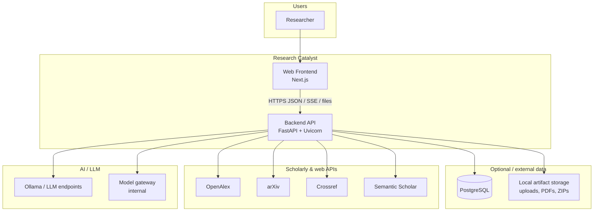

### 4.2 Container diagram (inside the backend)

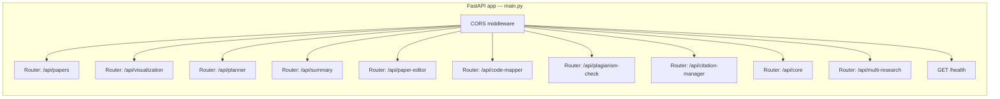

### 4.3 Layered view (how code is organized)

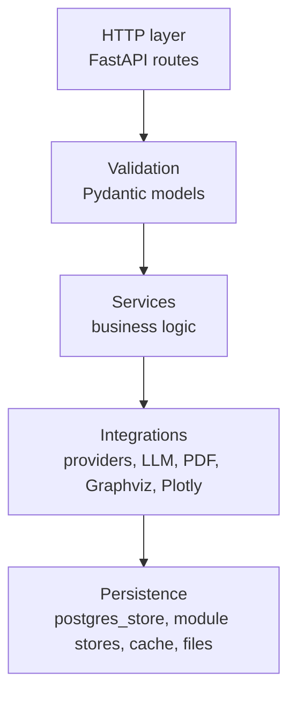

### 4.4 API prefix map (single slide)

| Prefix | Module |
|--------|--------|
| `/api/papers` | Paper search |
| `/api/visualization` | Diagrams & charts |
| `/api/planner` | Research planner |
| `/api/summary` | Summary discovery & workspace |
| `/api/paper-editor` | LaTeX editor & writing assistant |
| `/api/code-mapper` | Paper→code & repo→paper |
| `/api/plagiarism-check` | Plagiarism MVP |
| `/api/citation-manager` | Citations |
| `/api/core` | Backbone: projects, evidence, retrieval, gateway |
| `/api/multi-research` | Multi-agent pipeline |

### 4.5 Typical request/response flow

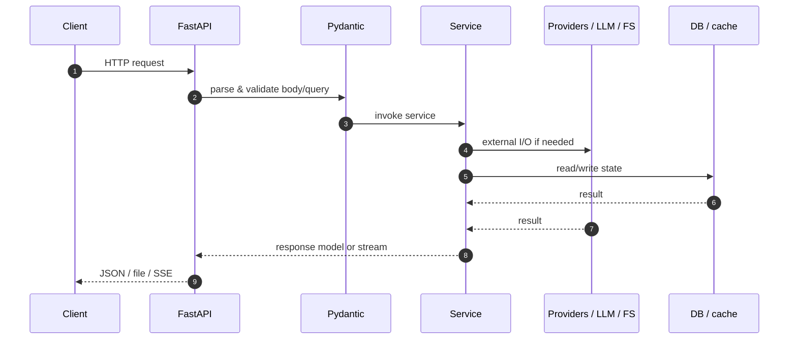

---

## 5. Data & persistence (where state lives)

### 5.1 Conceptual data stores

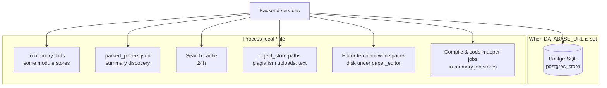

### 5.2 Rules of thumb for presentations

- **Planner / core / editor projects**: Prefer **Postgres** when configured; else **in-memory** or reduced persistence (see code for each `*_store`).
- **Summary papers list**: Loaded from **`parsed_papers.json`** (plus **uploaded PDF summaries** registered in memory).
- **Paper search**: **Ephemeral cache** (24h) for query results — not a full document DB.

---

## 6. Methodology & development workflow

### 6.1 Configuration workflow

1. Copy or edit **`.env`** in `backend/` or project root (`python-dotenv` loads both; backend `.env` first without overriding root in a conflicting way — see `main.py`).
2. Set at least **`CORS_ORIGINS`** for your frontend URL.
3. Set **`DATABASE_URL`** if you want Postgres-backed workspace and backbone features.
4. Set **LLM-related** variables for features that need them (e.g. **`OLLAMA_*`** for multi-research; other modules may use gateway or provider-specific env).

### 6.2 Run & develop

```text
cd backend
python -m uvicorn main:app --reload --port 8000
```

- Interactive API docs: **`/docs`** (FastAPI Swagger) when the server runs.

### 6.3 Module development pattern

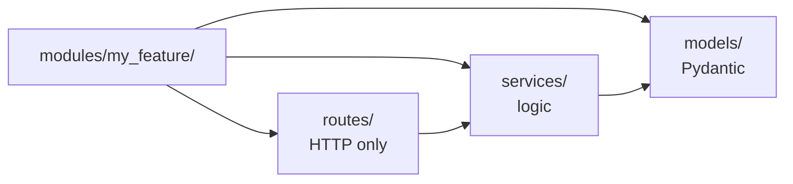

### 6.4 Testing strategy (what you can say in review)

- Exercise endpoints via **`/docs`**, Postman, or frontend.
- Long jobs: poll **status** endpoints or consume **SSE** streams.
- LLM features: verify **`/api/code-mapper/test-llm`** or equivalent when you need a smoke test.

---

## 7. Technologies used (expanded)

| Layer | Technology | Role |
|-------|------------|------|
| Language | Python 3 | Backend implementation |
| Framework | FastAPI | REST API, dependency injection, OpenAPI |
| Server | Uvicorn | ASGI server |
| Validation | Pydantic v2 | Request/response models |
| DB driver | psycopg | PostgreSQL when enabled |
| HTTP clients | httpx, requests | Provider APIs |
| PDF | PyMuPDF, pypdf | Extract text, processing |
| Documents | python-docx | Word I/O in code mapper / uploads |
| Diagrams | graphviz (Python), Mermaid passthrough | DOT → SVG |
| Charts | Plotly, Kaleido | Charts and raster/PDF export |
| Streaming | sse-starlette | SSE for multi-research and code mapper |
| Agents | CrewAI | Multi-agent research pipeline |
| Tokens | tiktoken | Chunking / limits |
| Scraping / HTML | beautifulsoup4 | Parsers where needed |
| Resilience | tenacity | Retries |
| Config | python-dotenv | Environment |

**Source of truth for versions:** `backend/requirements.txt`.

---

## 8. Implementation — module-by-module (large overview)

Below: **purpose**, **main endpoints (representative)**, **notes** — trim per slide.

### 8.1 `paper_search` — `/api/papers`

- **Purpose**: Federated academic search with deduplication and ranking.
- **Key endpoint**: `GET /api/papers/search` — query, year filters, open-access filter, limit.
- **Pipeline**: cache → parallel providers (OpenAlex, arXiv, Crossref, Semantic Scholar) → merge → dedupe → rank → cache → return.
- **Slide line**: “One query fans out to four scholarly sources, then we merge and rank.”

### 8.2 `visualization` — `/api/visualization`

- **Purpose**: Research diagrams and charts for papers and slides.
- **Endpoints (groups)**:
  - Structure → DOT / render: `diagram/generate`, `diagram/render` (Graphviz; Mermaid returned for frontend rendering).
  - Charts: `chart/generate` (Plotly).
  - Export: `export` (SVG → PNG/PDF).
  - AI: `ai/text-to-diagram`, `ai/code-to-diagram`.
- **Slide line**: “From structured nodes or raw text/code to diagrams and exportable figures.”

### 8.3 `planner` — `/api/planner`

- **Purpose**: Research projects, milestones, and generated plans.
- **Endpoints**: list/create/get/delete **projects**; add/update/delete **milestones**; **generate** plan for a project (`POST .../generate`).
- **Engines**: Rule-based planner + optional **LLM** planner (`rule_engine`, `llm_engine`).
- **Persistence**: **Postgres** when `DATABASE_URL` set (`kind=planner` workspace projects + milestones); else in-memory store.

### 8.4 `summary` — `/api/summary`

- **Purpose**: Curated/summary paper browser + **workspace** (chat, synthesis, tables, gaps) + **screening** + PDF upload summarization.
- **Data**: `parsed_papers.json` drives categories and listing; uploaded PDFs processed in-memory registry after summarize.
- **Representative endpoints**:
  - Discovery: `/categories`, `/papers`, `/papers/search`, `/papers/{slug}`.
  - Workspace: `/workspace/chat`, `/workspace/synthesize`, `/workspace/extract-table`, `/workspace/gap-analysis`.
  - Collections & screening sessions/entries.
  - `POST /upload` (PDF), `GET /uploaded`.

### 8.5 `paper_editor` — `/api/paper-editor`

- **Purpose**: LaTeX-centric writing with template upload, inject, compile, download; **v2** writing assistant.
- **Groups**:
  - Template: upload ZIP, inject content, compile job, status, preflight, download PDF/tex.
  - V2 compile from source files.
  - Writing assistant: grounded draft, autocomplete, citation recommendations, claim trace, manuscript review, reviewer response, compliance, unified assist.
- **Slide line**: “End-to-end LaTeX workspace with async compile and AI writing tools.”

### 8.6 `code_mapper` — `/api/code-mapper`

- **Purpose A — Paper → code**: Upload PDF/DOCX → parse → extract methodology → blueprint → generate files → validate → ZIP.
- **Purpose B — Repo → paper**: GitHub URL → analyze → generate report sections → export LaTeX/Word; optional **section edits** then re-export.
- **Transport**: REST + **SSE** streams for progress; job IDs for status/result/download.
- **Utility**: `POST /test-llm` for configuration smoke test.

### 8.7 `plagiarism_check` — `/api/plagiarism-check`

- **Purpose**: MVP overlap scoring vs **retrieved scholarly abstracts** (not full-web index).
- **Endpoints**: settings, list/get jobs, `scan/text`, `scan/file` (size/type limits); artifacts via **`object_store`**.

### 8.8 `citation_manager` — `/api/citation-manager`

- **Purpose**: Citation projects CRUD, citation entries, **`POST /generate`** to format a citation from a free-text source string.

### 8.9 `core` — `/api/core`

- **Purpose**: Shared **backbone**: canonical projects, documents, evidence chunks, claims; **tasks**; **model gateway**; **prompt** registry; **retrieval** ingest/search; **editor-projects** in Postgres when enabled.
- **Slide line**: “Core is the integration layer for evidence-linked projects and RAG-style retrieval.”

### 8.10 `multi_research` — `/api/multi-research`

- **Purpose**: **CrewAI** sequential crew — planner → search → validator → extractor → synthesizer — producing a **Markdown report**.
- **Endpoints**: `POST /run` (**SSE** progress), `POST /run-sync` (full result in one response).
- **Config**: **`OLLAMA_API_KEY`**, **`OLLAMA_BASE_URL`**, **`OLLAMA_MODEL`**, **`LLM_TEMPERATURE`** (see `pipeline.py`).

---

## 9. Pipelines (detailed diagrams for technical slides)

### 9.1 Paper search pipeline

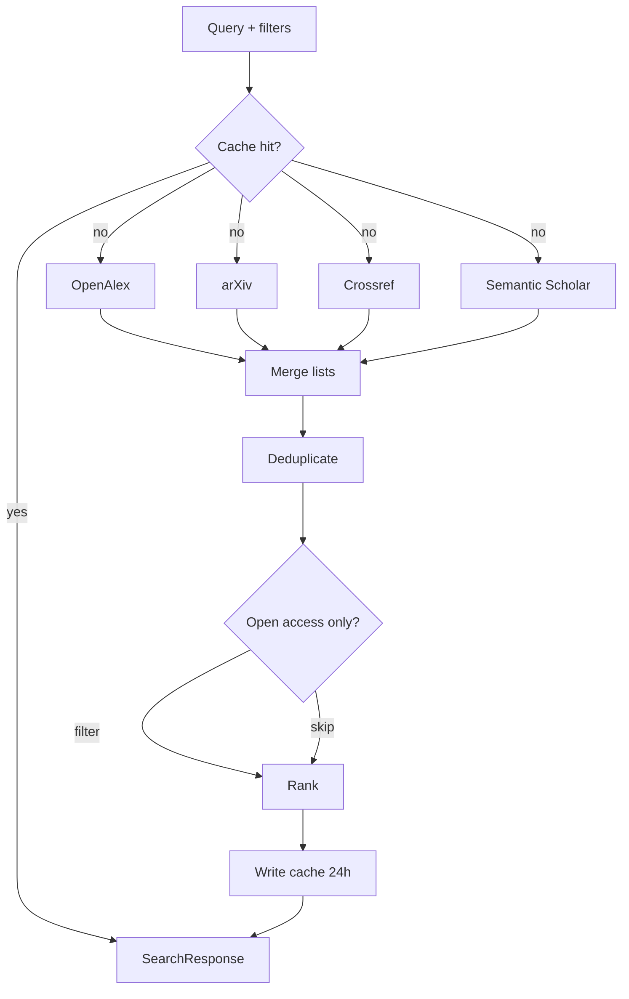

### 9.2 Multi-agent research pipeline (conceptual)

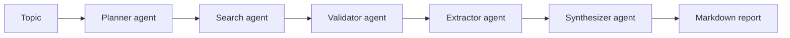

### 9.3 Code mapper — paper to code

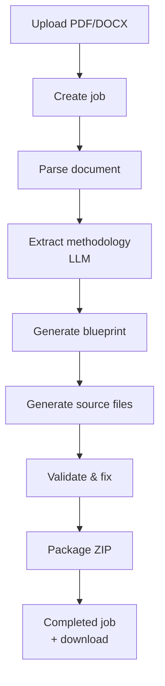

### 9.4 Code mapper — repo to paper

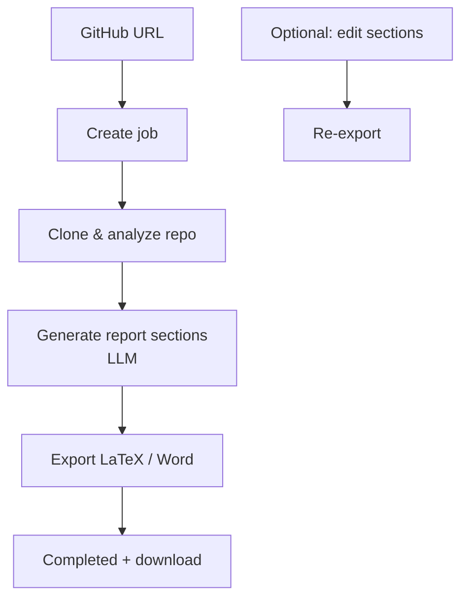

### 9.5 Paper editor — compile job (simplified)

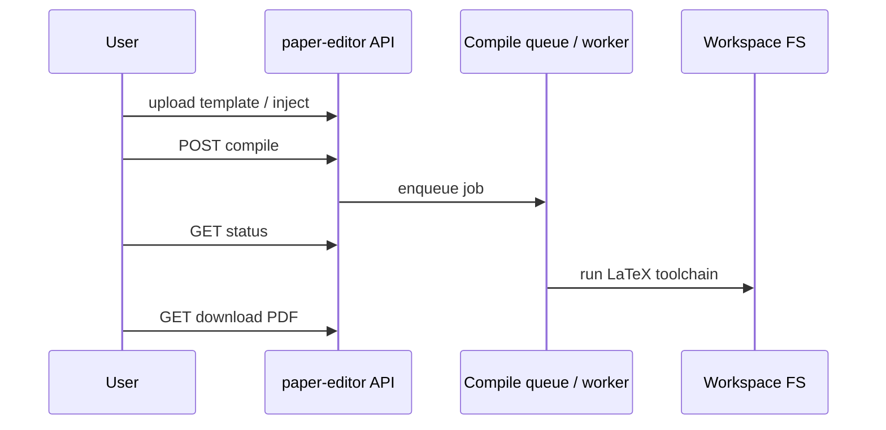

---

## 10. Non-functional aspects & configuration (talking points)

- **CORS**: Controlled by **`CORS_ORIGINS`** — required for browser access from your Next.js origin.
- **Scalability**: Long work runs in **background threads** / async patterns per module; **stateless API** except where jobs are stored in memory (restart may lose in-flight jobs — mention if asked).
- **Security**: File type and size limits on uploads; **do not commit secrets**; use `.env` locally.
- **Observability**: **`GET /health`**; structured job IDs; SSE for progress.

### 10.1 Environment variables (non-exhaustive checklist)

| Variable | Typical use |
|----------|-------------|
| `CORS_ORIGINS` | Frontend URLs |
| `DATABASE_URL` | PostgreSQL |
| `OLLAMA_API_KEY`, `OLLAMA_BASE_URL`, `OLLAMA_MODEL` | Multi-research CrewAI LLM |
| `LLM_TEMPERATURE` | Multi-research |
| Other | Module-specific (gateway, providers) — scan `.env.example` or code |

---

## 11. Future work / extensions (optional slide)

- Stronger **authentication** and multi-tenant isolation.
- **Persistent** job queues (Redis/RQ/Celery) for compile and code generation.
- Deeper **plagiarism** corpus or licensed databases.
- More **search providers** and richer ranking features.
- **Monitoring** (structured logging, metrics, tracing).

---

## 12. Diagram index (all figures)

Copy any diagram below as a standalone slide asset.

1. **§4.1** — Context diagram (users, frontend, backend, DB, scholarly APIs, LLM).
2. **§4.2** — Container diagram (routers inside FastAPI).
3. **§4.3** — Layered architecture.
4. **§4.5** — Sequence: request through validation and services.
5. **§5.1** — Persistence overview.
6. **§6.3** — Module folder pattern.
7. **§9.1** — Paper search pipeline.
8. **§9.2** — Multi-agent stages.
9. **§9.3** — Paper → code pipeline.
10. **§9.4** — Repo → paper pipeline.
11. **§9.5** — LaTeX compile sequence.

**Earlier compact figures (still valid for simple slides):**

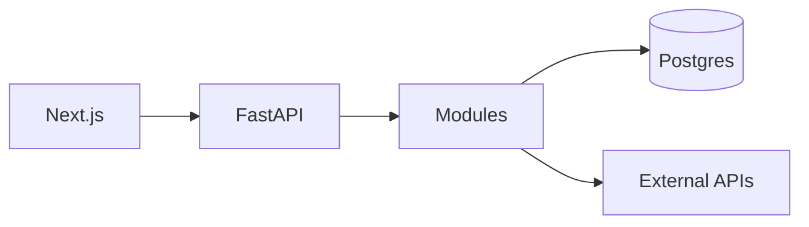

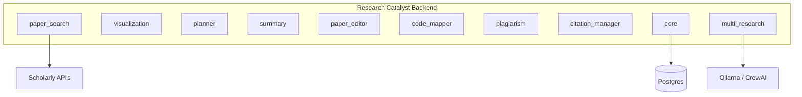

---

## 13. Closing line for presentation

**Research Catalyst’s backend** is a **modular FastAPI service** that connects a **Next.js** frontend to **scholarly data**, **file and template workflows**, **LLM-assisted writing and research agents**, and **optional PostgreSQL** — giving researchers a **single API surface** for the full research lifecycle.

---

*Source: `backend/main.py`, `requirements.txt`, and `modules/*`. Trim sections to fit your time slot.*
