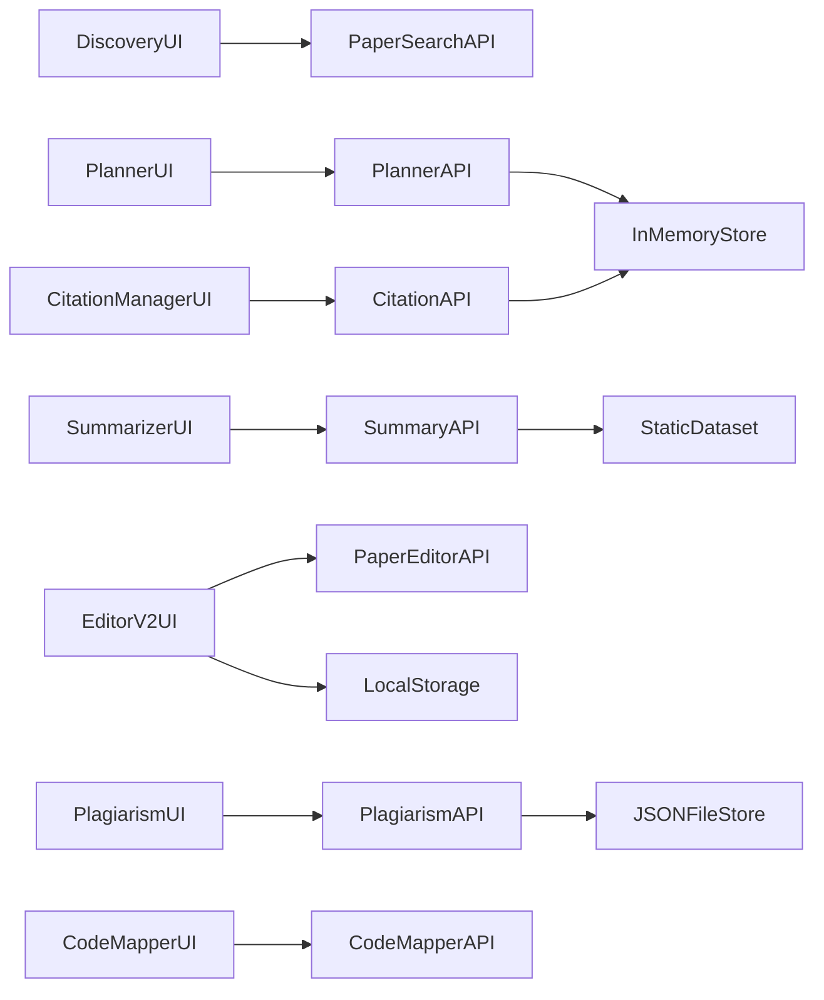

# Current-State Capability, Storage, and Integration Map

## Scope

This map documents the current implementation state across frontend routes, backend modules, persistence approaches, and cross-module integration seams.

## Frontend Capability Map (`src/app`)

| Route | Purpose | Backend Dependency | Current Maturity |
|---|---|---|---|
| `/discovery` | Academic paper discovery UI | `/api/papers` | Strong |
| `/planner` | Project + milestones planning | `/api/planner` | Medium (storage gap) |
| `/visualize` | Diagram/chart generation | `/api/visualization` | Strong |
| `/summarizer` | Summary browsing + detail views | `/api/summary` | Medium (static dataset) |
| `/editor-v2` | LaTeX writing workspace | `/api/paper-editor` (compile/generation) | Medium (local-first persistence) |
| `/citation-manager` | Project citations CRUD and generation | `/api/citation-manager` | Medium (in-memory backend store) |
| `/plagiarism-check` | Upload, scan, and result review | `/api/plagiarism-check` | Medium (MVP heuristics) |
| `/code-mapper/paper-to-code` | Paper implementation scaffold generation | `/api/code-mapper/paper-to-code/*` | Strong |
| `/code-mapper/repo-to-paper` | Repo analysis and paper generation | `/api/code-mapper/repo-to-paper/*` | Strong |

## Backend Module Map (`backend/modules`)

| Module | Key Responsibility | Route Prefix | Notable Strength |
|---|---|---|---|
| `paper_search` | Parallel provider search + ranking + dedupe | `/api/papers` | Multi-source academic search orchestration |
| `planner` | Research plan generation + milestone management | `/api/planner` | Rule/LLM plan generation |
| `visualization` | Mermaid/Graphviz/Plotly + AI diagram creation | `/api/visualization` | Broad diagram tooling |
| `summary` | Summary browsing and detail retrieval | `/api/summary` | Clean API but static data dependency |
| `paper_editor` | Section generation/refinement, template inject, compile jobs | `/api/paper-editor` | End-to-end authoring pipeline |
| `citation_manager` | Citation projects, records, generation from DOI/metadata | `/api/citation-manager` | Practical citation formatting entry point |
| `plagiarism_check` | Async plagiarism checks with job tracking | `/api/plagiarism-check` | End-to-end scan flow skeleton |
| `code_mapper` | Paper-to-code and repo-to-paper async pipelines | `/api/code-mapper` | High-value differentiator |

## Storage and State Reality Check

| Capability | Current Store | Risk |
|---|---|---|
| Planner projects/milestones | In-memory Python dictionary | Data loss on restart, no multi-user |
| Citation projects/citations | In-memory `_Store` object | Non-durable, not shareable |
| Editor V2 projects/files | Browser `localStorage` | Device-locked, no team collaboration |
| Plagiarism jobs | `backend/data/plagiarism_jobs.json` | Limited concurrency and recovery |
| Summary corpus | Static `parsed_papers.json` | Not live and hard to personalize |
| Domain schema target | Prisma + PostgreSQL models | Underutilized versus runtime stores |

## Integration Flow Map (Current)

## Critical Bottlenecks (Root Cause View)

1. **Fragmented persistence model** blocks collaboration, auditability, and cross-module composition.
2. **No shared evidence abstraction** forces each module to re-parse or duplicate source context.
3. **Inconsistent model/provider orchestration** increases drift and quality variance.
4. **Summary and verification stack are not live-ingestion-first** limiting parity with market leaders.
5. **Collaboration UX exists partially in UI but lacks server-backed primitives** (comments, ACL, realtime sync).

## Immediate Integration Opportunities

1. Introduce a canonical `ResearchProject` backbone persisted in Prisma.
2. Add `Document` + `EvidenceChunk` entities to bridge discovery, summarizer, editor, and plagiarism.
3. Centralize async job semantics (queue, retries, status, telemetry) across editor/plagiarism/code-mapper.
4. Add source-grounding primitives (`Claim`, `CitationLink`, `VerificationTask`) reused by writing and trust features.
