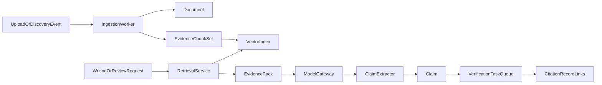

# Shared Backbone Specification

## Objective

Define canonical domain models and architecture contracts enabling feature composition across discovery, summarization, writing, citations, plagiarism, and verification.

## Canonical Domain Model

### Core Entities

- `ResearchProject`: tenant-scoped root object for all research workflows.
- `Document`: uploaded file, discovered paper, generated draft, or external source artifact.
- `EvidenceChunk`: normalized, retrievable text fragment with provenance metadata.
- `Claim`: verifiable statement produced by user or model.
- `CitationRecord`: bibliographic entry with metadata confidence and source links.
- `VerificationTask`: queued validation operation for claims/citations.
- `WorkspaceTask`: background async task for ingestion, retrieval, synthesis, compile, and exports.

### Relationship Rules

- `ResearchProject` owns many `Document`, `Claim`, `CitationRecord`, and `WorkspaceTask`.
- `Document` owns many `EvidenceChunk`.
- `Claim` may link to many `EvidenceChunk` and many `CitationRecord`.
- `VerificationTask` references one `Claim` or one `CitationRecord`.
- `WorkspaceTask` writes status artifacts and metric breadcrumbs.

## Architecture Contracts

### 1) Persistence Contract

- Source of truth: Prisma/PostgreSQL.
- Legacy stores (in-memory, JSON, local storage) must be cut over behind dual-write windows.
- Every write operation requires actor context (`user_id`, `project_id`, `trace_id`).

### 2) Retrieval Contract

- Ingestion splits documents into normalized chunks.
- Chunks produce embeddings and keyword metadata.
- Retrieval interface supports:
  - semantic top-k
  - metadata-filtered search
  - hybrid retrieval (semantic + lexical)

### 3) Model Gateway Contract

- Single entry point for all LLM calls.
- Required payload fields:
  - `task_type`
  - `messages`
  - `project_id`
  - `trace_id`
  - optional grounding references
- Response includes:
  - generated text
  - model/provider identity
  - token/cost metadata
  - safety/grounding signals

### 4) Job Orchestration Contract

- Unified task state machine:
  - `queued`
  - `running`
  - `succeeded`
  - `failed`
- Required observability fields:
  - `task_id`
  - `project_id`
  - `task_type`
  - `attempt`
  - `duration_ms`
  - `error_code`

## Reference Data Flow

## Incremental Adoption Plan

1. Add new canonical models and interfaces without breaking existing endpoints.
2. Migrate planner and citation stores first (lowest complexity, high impact).
3. Migrate editor project state to server storage with compatibility adapter.
4. Introduce evidence ingestion and retrieval for summarizer/discovery.
5. Route writing and verification prompts through model gateway.

## Acceptance Criteria

- Cross-module workflows share project identity and source evidence.
- A claim created in editor can be verified and linked to citations.
- Project data survives restarts and is accessible across devices.
- Background tasks expose consistent status and telemetry.
